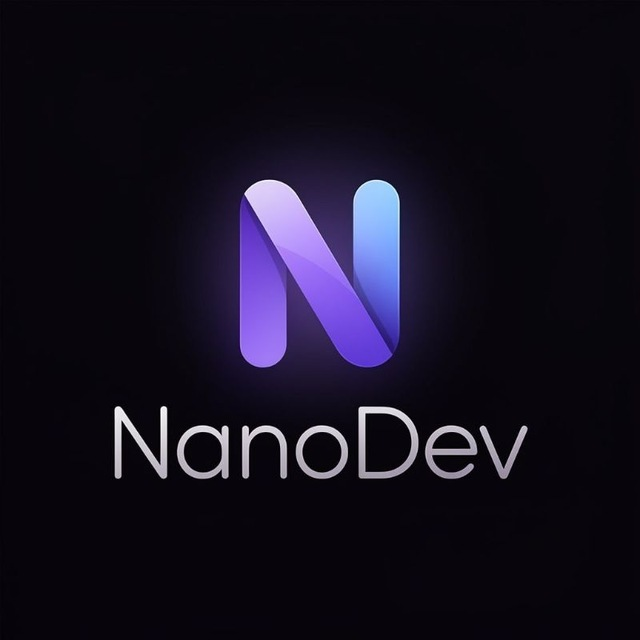
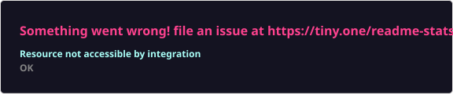

  

  

✧･ﾟ: *✧･ﾟ:* 　　*:･ﾟ✧*:･ﾟ✧

  ➳ 🔧 Сейчас переписываю <a href="https://github.com/nanodev1488/NanoDecompiler"><b>ɴᴀɴᴏᴅᴇᴄᴏᴍᴘɪʟᴇʀ</b></a> на C++ (V2.0, раньше был на Python) 
  ➳ 📡 Веду телеграм-канал: <a href="https://t.me/nanodev_MC">t.me/nanodev_MC</a> 
  ➳ 🤝 Состою в сообществе <b>ʀᴜᴍɪɴᴇ</b> 
  ➳ ⚡ Люблю активничать

  
  
  
  
  

▄︻デ══━一 ▄▀▄▀▄▀▄▀▄▀▄▀▄▀▄▀▄▀▄▀▄▀▄ 一━══デ︻▄

## 📊 ᴄᴛᴀᴛиᴄᴛиᴋᴀ

  
  

## 🏆 ᴛᴩоɸᴇи

  

## 📈 ᴦᴩᴀɸиᴋ ᴀᴋᴛиʙноᴄᴛи

  

## 🐍 ᴄᴏɴᴛʀɪʙᴜᴛɪᴏɴ sɴᴀᴋᴇ

  

## 💬 циᴛᴀᴛᴀ дня

<!--QUOTE-START-->
> To do great work one must be very idle as well as very industrious.
>
> — Samuel Butler
<!--QUOTE-END-->

## 📌 ᴨᴩо ɴᴀɴᴏᴅᴇᴄᴏᴍᴘɪʟᴇʀ

<!--PROJECT-STATUS-START-->
- ⭐ Звёзды: **1**
- 🈺 Основной язык: **Python**
- 📝 Последний коммит: _update v1.6_
- 🕒 Обновлено: 2026-08-13 07:16 UTC
<!--PROJECT-STATUS-END-->

## 📡 ᴨоᴄᴧᴇдниᴇ ᴨоᴄᴛы ʙ ᴋᴀнᴀᴧᴇ

<!--TG-FEED-START-->
- [Идея Ai модели для правок и поиска багов откладывается так как возникли огромные трудности с ней. Извиняюсь за ложную инфу ❤️](https://t.me/NanoDev_mc/108)
- [ɴᴀɴᴏᴅᴇᴠ • ʀᴇʙᴏᴏᴛ pinned « Создаём? »](https://t.me/NanoDev_mc/105)
- [(медиа-пост)](https://t.me/NanoDev_mc/104)
<!--TG-FEED-END-->

▄︻デ══━一 ▄▀▄▀▄▀▄▀▄▀▄▀▄▀▄▀▄▀▄▀▄▀▄ 一━══デ︻▄

˜”*°•.•°*”˜ ✦ ˜”*°•.•°*”˜

